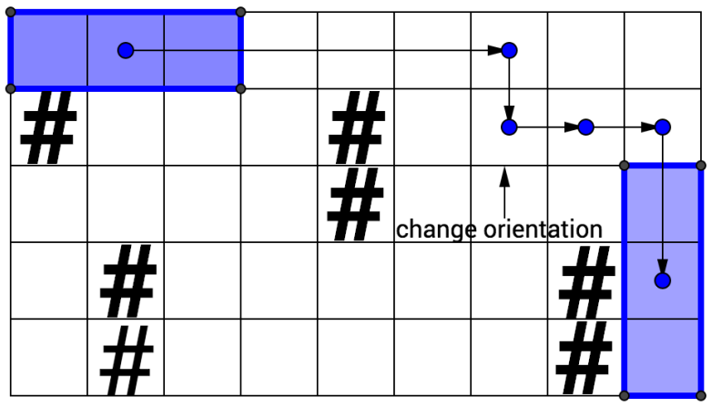

# Problem definition
The goal is to carry the rod from the top left corner of the labyrinth to the bottom
right corner. This rod is not exactly the lightest thing you can imagine, so the participant would naturally want to do it as fast as possible.

Find the minimal number of moves required to carry the rod through the labyrinth. The labyrinth can be represented as a rectangular matrix, some cells of which are marked as blocked `(#)`, and the rod can be represented as a $1 \times 3$ rectangle. The rod can't collide with the blocked cells or the walls, so it's impossible to move it into a position in which one of its cells coincides with the blocked cell or the wall. The goal is thus to move the rod into position in which one of its cells is in the bottom right cell of the labyrinth.

There are 5 types of moves that the participant can perform: move the rod one cell
down or up, to the right or to the left, or to change its orientation from vertical to horizontal and vice versa. The rod can only be rotated about its center, and only if the $3 \times 3$ area surrounding it is clear from the obstacles or the walls.

The rod is initially positioned horizontally, and its left cell lies in $[0, 0]$.

### Labyrinth graphical example [1]

### Labyrinth codification example
    labyrinth = [
        [".",".",".",".",".",".",".",".","."],
        ["#",".",".",".","#",".",".",".","."],
        [".",".",".",".","#",".",".",".","."],
        [".","#",".",".",".",".",".","#","."],
        [".","#",".",".",".",".",".","#","."]
    ]

The result in this example is 11.

# A* approach
The strategy followed for solving the problem has been an A* search approach [2]. It evaluates nodes by combining $g(n)$, the cost to reach the node, and $h(n)$, the cost to reach the goal node:

$f(n) = g(n) + h(n)$

Since $g(n)$ gives us the cost of the path from the start node to node $n$, and $h(n)$ gives us the estimated cost of the cheapest path from $n$ to the goal, we have:
$f(n)$ = estimated cheapest cost of the solution through $n$.
Thus, if we try to find the cheapest solution, it is reasonable to first consider the node with the lowest value of $g(n) + h(n)$. It turns out that this strategy is more than reasonable: as long as the heuristic function $h(n)$ satisfies certain conditions, the A* search is both complete and optimal.

Regarding the constraints implemented within the algorithm, the following stand out:

1. The rod must start horizontally from the position $(0, 0)$.
2. The maze must be an $N \times M$ matrix within the range $[3, 1000]$.
3. The algorithm must return an integer representing the minimum number of moves to reach from a starting point to an ending point, returning `-1` in case a viable solution is not found.
4. The rotation of the rod around its own center can only be carried out if there are no obstacles or walls within a $3 \times 3$ area around its center. For this purpose, a kernel function has been used.
5. The new position for a node is represented as follows:

| Movement | Codification |
| -------- | ------------ |
| Down | $(0, 1)$ |
| Up | $(0, -1)$ |
| Right | $(1, 0)$ |
| Left | $(-1, 0)$ |

6. The new position of the node must adhere to the constraints of the rod's area projection onto the maze, meaning that the $3 \times 1$ horizontal area and the $1 \times 3$ vertical area cannot overlap with blockages or maze walls.

# How to run
## Via command line
If you are using directly the command line, you have to enter to `damavis-data-engineer-challenge/src` and then run as follows:

    python3 main.py -L [test_1 test_2 ... test_n]

    python3 main.py -L ../test/test_3.json ../test/test_4.json ../test/test_2.json

## Via Visual Studio Code
You can open the project at `damavis-data-engineer-challenge/` and then press `Add Configuration...`. This will deploy a `json` configuration file within your project where you can set up all the parameters:

    {
        // Use IntelliSense to learn about possible attributes.
        // Hover to view descriptions of existing attributes.
        // For more information, visit: https://go.microsoft.com/fwlink/?linkid=830387
        "version": "0.2.0",
        "configurations": [
            {
                "name": "Python: Current File",
                "type": "python",
                "request": "launch",
                "program": "src/main.py",
                "console": "integratedTerminal",
                "justMyCode": true,
                "args": [
                    "-L",
                    "test/test_1.json",
                    "test/test_2.json",
                    "test/test_3.json",
                    "test/test_4.json",
                    "test/test_5.json",
                    "test/test_6.json",
                ]
            }
        ]
    }

Then, you can press:
1. `F5`: Run in debug mode.
2. `Ctrl+F5`: Run without debug mode.

# Main test cases
## Test 1

    labyrinth = [
        [".",".",".",".",".",".",".",".","."],
        ["#",".",".",".","#",".",".",".","."],
        [".",".",".",".","#",".",".",".","."],
        [".","#",".",".",".",".",".","#","."],
        [".","#",".",".",".",".",".","#","."]
    ]

Expected result: 11

## Test 2

    labyrinth = [
        [".",".",".",".",".",".",".",".","."],
        ["#",".",".",".","#",".",".","#","."],
        [".",".",".",".","#",".",".",".","."],
        [".","#",".",".",".",".",".","#","."],
        [".","#",".",".",".",".",".","#","."]
    ]

Expected result: -1

## Test 3

    labyrinth = [
        [".",".","."],
        [".",".","."],
        [".",".","."]
    ]

Expected result: 2
> **Note:** Although the expected result is 2, I believe it should be 3. Waiting for review.

## Test 4

    labyrinth = [
        [".",".",".",".",".",".",".",".",".","."],
        [".","#",".",".",".",".","#",".",".","."],
        [".","#",".",".",".",".",".",".",".","."],
        [".",".",".",".",".",".",".",".",".","."],
        [".",".",".",".",".",".",".",".",".","."],
        [".","#",".",".",".",".",".",".",".","."],
        [".","#",".",".",".","#",".",".",".","."],
        [".",".",".",".",".",".","#",".",".","."],
        [".",".",".",".",".",".",".",".",".","."],
        [".",".",".",".",".",".",".",".",".","."]
    ]

Expected result: 16

# Extra test cases
## Test 5

    labyrinth = [
        [".","."],
        [".","."],
        [".","."]
    ]

Expected result: "ValueError"

## Test 6

    labyrinth = [
        [".",".","."],
        [".",".","."]
    ]

Expected result: "ValueError"

## Test 7

    labyrinth = [
        [".",".","."],
        [".",".","."],
        [".",".","."]
    ]

    start = (-1, 0)

Expected result: "ValueError"

## Test 8

    labyrinth = [
        [".",".","."],
        [".",".","."],
        [".",".","."]
    ]

    end = (2, 999_999)

Expected result: "ValueError"

# References
[1]: [Damavis studio](https://damavis.com/en/).

[2]: Russell, Stuart J. and Norvig, Peter. (2010). Artificial Intelligence: A modern approach. Prentice-Hall.